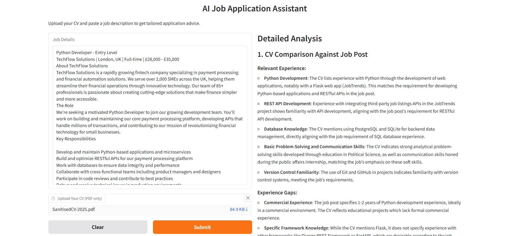
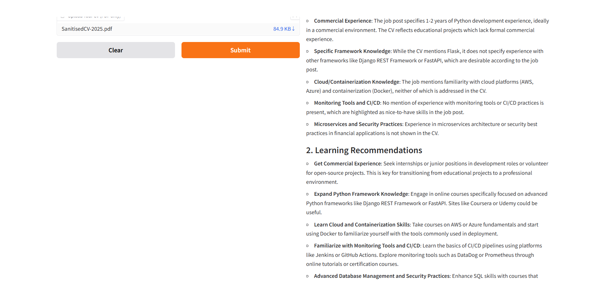
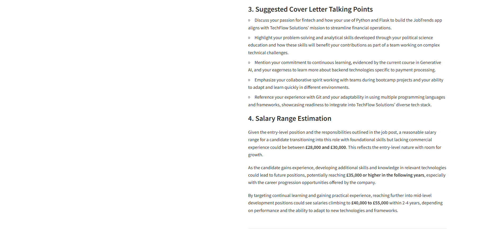

# AI Job Application Assistant

An app tailored for CV optimisation and application insights using GPT-4o-mini

## Features

### Core Functionality:
- **CV-Job Matching Analysis** - Compares uploaded CV against job requirements to identify relevant experience and skills alignment
- **Skill Gap Identification** - Detects missing skills and qualifications between candidate profile and job requirements
- **Learning Recommendations** - Provides specific guidance and resources for bridging identified skill gaps
- **Tailored CV Optimisation** - Generates customised bullet points emphasising relevant experience for the specific role
- **Cover Letter Guidance** - Suggests targeted talking points based on CV content and job requirements
- **Salary Estimation** - Provides market-based salary range predictions considering location, role level, and requirements

### User Experience:
- **PDF Upload Support** - Processes CV files in PDF format with robust text extraction
- **Responsive Interface** - Clean, modern web interface that works across devices
- **Real-time Analysis** - Streaming responses provide immediate feedback during processing
- **Error Handling** - Comprehensive validation and user-friendly error messages

## Tech Stack
- Python, OpenAI API, Gradio

## Screenshots - testing the AI Job Application Assistant with a mock job posting and CV

##

##

